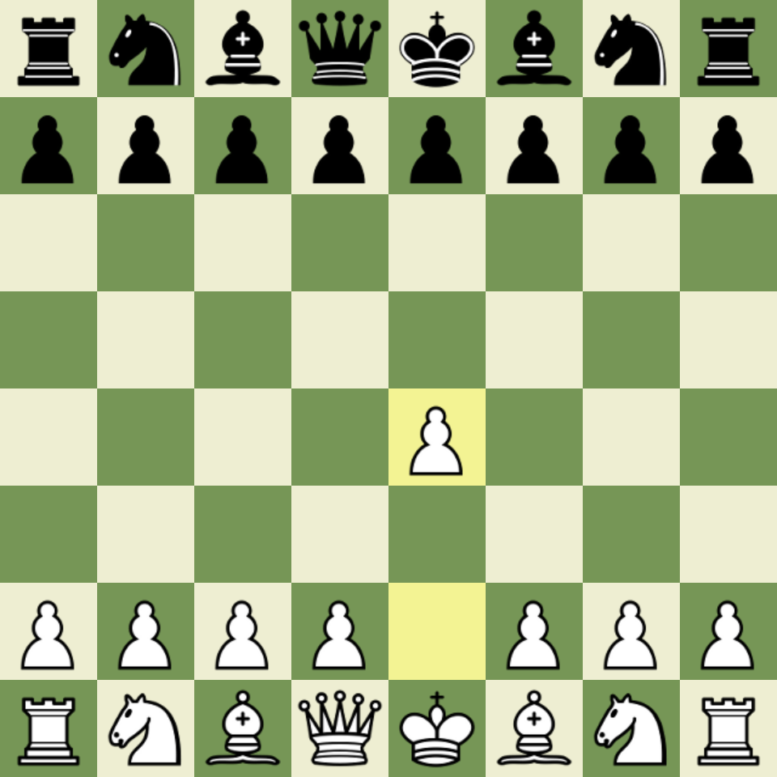

# chess2img

<div align="center">
  
  <p>Generate PNG chessboard images from FEN, PGN, or board arrays in Node.js.</p>
  <p>
    <a href="https://www.npmjs.com/package/chess2img"></a>
    <a href="https://www.npmjs.com/package/chess2img"></a>
    <a href="https://www.npmjs.com/package/chess2img"></a>
    <a href="https://github.com/ZiriloXXX/chess2img"></a>
  </p>
</div>

## Overview

`chess2img` renders chessboard PNGs from FEN, PGN, or board-array inputs with a small Promise-based API for JavaScript and TypeScript users on Node.js.

## Features

- Render PNG chessboard images from `fen`, `pgn`, or `board` input.
- Use five bundled built-in themes: `merida`, `alpha`, `cburnett`, `cheq`, and `leipzig`.
- Highlight squares such as the last move or key tactical ideas.
- Customize board colors, size, padding, border sizing, coordinates, and board orientation.
- Use either the functional `renderChess(...)` API or the `ChessImageGenerator` class API.
- Register custom themes globally or pass a theme inline for one-off rendering.
- Consume the package from both JavaScript and TypeScript projects.

## Example Output

Opening `1.e4` with a Chess.com-like board palette, highlighted origin and destination squares, and the built-in `cburnett` piece set.



## Quick Start

```bash
npm install chess2img
```

```ts
import { writeFile } from "node:fs/promises";
import { renderChess } from "chess2img";

const png = await renderChess({
  fen: "rnbqkbnr/pppppppp/8/8/4P3/8/PPPP1PPP/RNBQKBNR b KQkq e3 0 1",
  size: 480,
  style: "cburnett",
  colors: {
    lightSquare: "#EEEED2",
    darkSquare: "#769656",
    highlight: "rgba(246, 246, 105, 0.6)",
  },
  highlightSquares: ["e2", "e4"],
});

await writeFile("board.png", png);
```

`renderChess(...)` returns a `Promise<Buffer>` containing PNG data.

## Installation

```bash
npm install chess2img
```

### Node And Canvas Requirements

- Node.js `18+`
- native build support for `canvas`
- common Linux packages usually include Cairo, Pango, libpng, libjpeg, giflib, a C/C++ toolchain, and Python for `node-gyp`

If `canvas` fails to install, verify your system packages first. The library ships `canvas` as a direct dependency, but native prerequisites still need to exist on the host.

## Basic Usage

### Functional API

```ts
import { writeFile } from "node:fs/promises";
import { renderChess } from "chess2img";

const png = await renderChess({
  fen: "rnbqkbnr/pppppppp/8/8/8/8/PPPPPPPP/RNBQKBNR w KQkq - 0 1",
  size: 480,
  style: "merida",
});

await writeFile("board.png", png);
```

### Coordinates And Border

```ts
import { writeFile } from "node:fs/promises";
import { renderChess } from "chess2img";

const png = await renderChess({
  fen: "rnbqkbnr/pppppppp/8/8/4P3/8/PPPP1PPP/RNBQKBNR b KQkq e3 0 1",
  size: 480,
  style: "cburnett",
  borderSize: 24,
  coordinates: {
    enabled: true,
    color: "#333",
  },
});

await writeFile("board-with-coordinates.png", png);
```

### Class API

```ts
import { ChessImageGenerator } from "chess2img";

const generator = new ChessImageGenerator({
  size: 800,
  style: "alpha",
});

await generator.loadPGN("1. e4 e5 2. Nf3 Nc6 3. Bb5 a6");
generator.setHighlights(["e4", "e5"]);

await generator.toFile("board.png");
```

### JavaScript Usage

```js
const { renderChess } = require("chess2img");
const { writeFile } = require("node:fs/promises");

async function main() {
  const png = await renderChess({
    fen: "4k3/8/8/8/8/8/8/4K3 w - - 0 1",
    style: "merida",
  });

  await writeFile("board.png", png);
}

main().catch(console.error);
```

## Built-In Themes

Bundled built-in themes:

- `merida`
- `alpha`
- `cburnett`
- `cheq`
- `leipzig`

Built-in themes are vendored in-package and render through the same theme pipeline as custom themes.

## Custom Themes

Register a reusable theme globally:

```ts
import { registerTheme } from "chess2img";

registerTheme({
  name: "custom-theme",
  displayName: "Custom Theme",
  license: "MIT",
  attribution: "Theme author or package source",
  pieces: {
    // 12 canonical pieces required
  },
});
```

Or pass either:

- a registered custom theme name through `theme: "custom-theme"`
- an inline `ThemeDefinition` object through `theme: { ... }`

Custom themes may use either:

- `svg` assets
- `png` assets

## API

### Public Exports

- `new ChessImageGenerator(options?)`
- `renderChess(options)`
- `registerTheme(theme)`

### Functional API

`renderChess(...)` accepts exactly one position source:

- `fen`
- `pgn`
- `board`

### Class API

Methods:

- `loadFEN(fen: string): Promise<void>`
- `loadPGN(pgn: string): Promise<void>`
- `loadBoard(board: BoardArray): Promise<void>`
- `setHighlights(squares: Square[]): void`
- `clearHighlights(): void`
- `toBuffer(): Promise<Buffer>`
- `toFile(filePath: string): Promise<void>`

Semantics:

- `setHighlights` replaces the current highlight set
- `clearHighlights` removes all highlights
- loading a new position clears highlights
- constructor defaults persist across position loads

### Options

- `size`: board size in pixels
- `padding`: `[top, right, bottom, left]`
- `borderSize`: inner border size in pixels, from `0` up to `Math.floor(size / 8)`
- `flipped`: render from black's perspective when `true`
- `style`: built-in theme alias
- `theme`: built-in theme name, registered custom theme name, or inline `ThemeDefinition`
- `highlightSquares`: array of algebraic squares such as `["e4", "d5"]`
- `coordinates`: `boolean` or `{ enabled?: boolean; color?: string }`
- `colors.lightSquare`
- `colors.darkSquare`
- `colors.highlight`

`coordinates: true` enables default coordinate labels. `coordinates: false` or omitting the option disables them. If coordinates are enabled while `borderSize` is `0`, rendering still succeeds but no labels are visible because no border band exists for them. At very small valid sizes, the renderer suppresses coordinates when they cannot fit legibly inside the available border bands.

### Errors

The library exports:

- `ValidationError`
- `ParseError`
- `ThemeError`
- `RenderError`
- `IOError`

## License

`chess2img` is distributed under the MIT license in package metadata.

Bundled built-in themes are derived from the upstream `andyruwruw/chess-image-generator` resource packs and are vendored in-package for deterministic installs. Provenance and licensing notes live in [ATTRIBUTION.md](./ATTRIBUTION.md).
